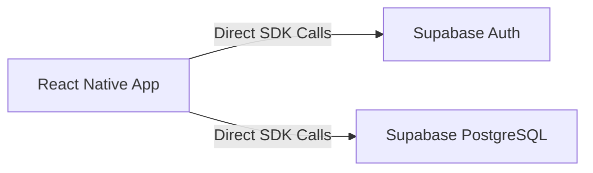
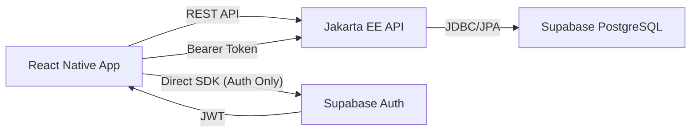

# Migration Plan: Moving to a Three-Tier Architecture

This document outlines the strategy for migrating the **NutriCost** mobile application from a direct-to-Supabase architecture to a three-tier architecture using a **Jakarta EE** backend as an intermediary.

## 1. Architecture Overview

### Current Architecture

### Target Architecture

**Rationale:**
- **Security:** Business logic and database access are centralized in the Java layer.
- **Maintainability:** Changes to the database schema only require updates in the Java layer, not the mobile app.
- **Scalability:** The Java layer can implement caching, complex aggregations, and integrate with other services (like AI) more efficiently.

---

## 2. Supabase → Java DB Migration Audit

The following table summarizes all direct Supabase interactions in `@NutriCost/` and their target Jakarta EE endpoints.

| Resource / Table | Operations | App File(s) | Target Jakarta EE Endpoint |
| :--- | :--- | :--- | :--- |
| **Auth** | Login, Register, SignOut, Reset | `LoginScreen`, `RegisterScreen`, etc. | `POST /auth/login`, `POST /auth/register` (or keep Supabase Auth) |
| `dim_recipe` | SELECT (Curated) | `AppContext.tsx` | `GET /recipes` (Existing) |
| `fact_user_recipe` | SELECT, INSERT, UPDATE, DELETE | `AppContext.tsx` | `GET/POST/PUT/DELETE /user-recipes` (**MISSING**) |
| `fact_user_recipe_product` | SELECT, INSERT, DELETE | `AppContext.tsx`, `RecipeDetailScreen.tsx` | Managed via `/user-recipes` or new `/user-recipes/{id}/products` (**MISSING**) |
| `fact_recipeingredient` | SELECT | `AppContext.tsx`, `RecipeDetailScreen.tsx` | `GET /recipe-ingredients/recipe/{id}` (Existing) |
| `fact_productprice` | SELECT | `AppContext.tsx`, `IngredientSearchScreen.tsx`, `RecipeDetailScreen.tsx` | `GET /recipes/{id}/costs` (Existing) or `GET /prices` (**MISSING**) |
| `dim_ingredient` | SELECT (Search) | `IngredientSearchScreen.tsx` | `GET /ingredients/search` (Existing) |

---

## 3. Java JDBC / JPA Configuration

`@jakartApp/` is already partially configured to connect to Supabase.

### Current Configuration
- **File:** `jakartApp/src/main/resources/db.properties`
- **URL:** `jdbc:postgresql://aws-0-eu-west-1.pooler.supabase.com:5432/postgres`
- **Driver:** PostgreSQL JDBC Driver.

### Required Updates
1. **SSL Configuration:** Ensure `ssl=true` is added to the connection string if Supabase enforces it (standard for Supabase).
2. **Environment Variables:** Move `db.user` and `db.password` from `db.properties` to system environment variables or a `.env` file (currently in `scripts/.env`, but should be accessible to the Java process).
3. **Connection Pooling:** `JpaUtil.java` currently creates an `EntityManagerFactory` manually. It is recommended to use a connection pool like **HikariCP** for production stability.

---

## 4. Endpoint Gap Analysis

### Existing Endpoints (Matching Needs)
- `GET /ingredients/search?term=...`: Used by `IngredientSearchScreen`.
- `GET /recipes`: Used by `RecipesScreen`.
- `GET /recipes/{id}/costs`: Partially replaces manual cost calculation in `AppContext`.

### Missing Endpoints (Action Required)

| Method | Path | Payload / Response | Purpose |
| :--- | :--- | :--- | :--- |
| `GET` | `/user-recipes` | `List<RecipeResponse>` | Fetch custom recipes for the logged-in user. |
| `POST` | `/user-recipes` | `RecipeRequest` -> `RecipeResponse` | Save a new custom recipe. |
| `PUT` | `/user-recipes/{id}` | `RecipeRequest` | Update an existing user recipe and its products. |
| `DELETE` | `/user-recipes/{id}` | `204 No Content` | Remove a user recipe. |
| `GET` | `/ingredients/{id}/prices` | `List<PriceDTO>` | Fetch latest prices across supermarkets for a specific ingredient. |

---

## 5. Authentication Migration

> ⚠️ Decision required: Recommended Approach - **JWT Validation**

**Rationale:**
Replacing Supabase Auth entirely is a massive undertaking. Instead, we will keep Supabase Auth on the frontend to handle registration and login.
1. React Native app logs in via Supabase and receives a **JWT**.
2. React Native app includes this JWT in the `Authorization` header for all calls to Jakarta EE.
3. Jakarta EE uses a **ContainerRequestFilter** to validate the JWT against Supabase's public key and extract the `user_id`.

**Required in Jakarta EE:**
- A JWT validation library (e.g., `jjwt` or `java-jwt`).
- A `SecurityContext` provider to make the `user_id` available in Resources.

---

## 6. React Native Changes Required

### Dependencies
- **Remove:** `@supabase/supabase-js` (eventually, except for Auth if kept).
- **Add:** `axios` or similar for standard HTTP calls to the Java API.

### Configuration Updates
- Create an `api.ts` utility that uses a `BASE_URL` pointing to the Jakarta EE server (e.g., `http://10.0.2.2:8080/jakartapp/api`).
- Update `AppContext.tsx` to call these API functions instead of `supabase.from()`.

### Environment Variables
- `EXPO_PUBLIC_API_URL`: URL of the Jakarta EE backend.

---

## 7. Step-by-Step Migration Plan

### Phase 1: Foundation (2 Days)
- **Task:** Configure JWT validation filter in `@jakartApp/`.
- **Task:** Create `UserRecipe`, `UserRecipeProduct` entities in Java.
- **Validation:** Call a "hello world" secured endpoint with a Supabase JWT from Postman.

### Phase 2: Read-Only Migration (3 Days)
- **Task:** Implement `GET /recipes` and `GET /ingredients/search` in Java to return data in the format expected by the app.
- **Task:** Update `NutriCost` to fetch recipes and search ingredients from the Java API.
- **Validation:** App should display curated recipes and allow searching without direct Supabase access.

### Phase 3: User Data Migration (4 Days)
- **Task:** Implement CRUD for `/user-recipes` in Jakarta EE.
- **Task:** Migrate logic for calculating recipe costs from `AppContext.tsx` to the Java Repository layer.
- **Task:** Update `CreateRecipeScreen` and `RecipeDetailScreen` to use the new API.
- **Validation:** Users can create/edit/delete recipes through the Java layer.

### Phase 4: Cleanup & Hardening (2 Days)
- **Task:** Remove all direct Supabase DB calls from the React Native app.
- **Task:** Enable CORS in Jakarta EE for the mobile app's origin.
- **Validation:** Comprehensive regression test of all app features.

---

## 8. Risks & Considerations

- **CORS:** Jakarta EE must be configured to allow requests from the mobile app's origin (especially during development with Metro).
- **Performance:** Complex queries that were "flat" in Supabase might suffer if JPA isn't tuned (e.g., N+1 problems when fetching ingredients for a recipe). **Use DTOs and JOIN FETCH.**
- **Realtime:** If the app uses Supabase Realtime (not currently observed), this must be replaced with WebSockets or Polling in the Java layer.
- **SSL:** Ensure Java truststores are updated to handle Supabase's SSL certificates if using internal networks.
